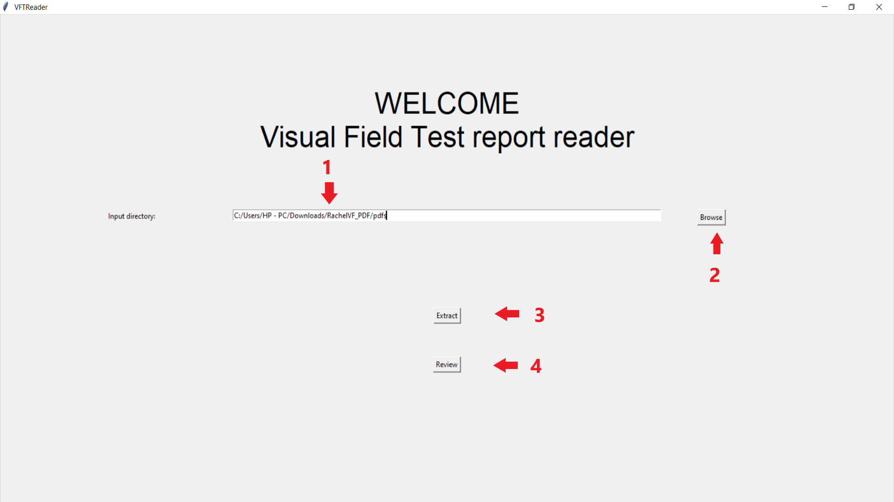

User Guide
==========

Welcome to the 'Visual Field Test reader' user guide. The application may be used to automatically
extract information from VFT reports, as well as reviewing and correcting the extracted reports.

This guide will show you how to:

* Extract data from a directory with VFT reports, and saving it to your device.
* Load and view your extracted data.
* Make changes to the data.

1) Extract data
----------------
The data extraction feature is located at the welcome screen.

1. The selected input directory. Every VFT reports in this directory will be extracted.
2. A browse button to browse for the input directory.
3. An extract button. Click to begin the extraction process.
4. A review button. After data extraction is completed, click to view your extracted reports.

First, place all the VFT reports that need to be extracted in a directory, and select the
directory using the browse button. Then, you may check again if the path to the directory is
correct, or select another directory. To begin extraction, click on the 'Extract' button. The
extraction process may take a while, so please wait patiently while it reads the reports. You 
may use the log window to monitor its progress.

.. note::
   The application currently can only read in files with the following extensions: ".png"; ".pdf"; ".tif"; ".jpg". 
   
When the extraction process is finished, the application will prompt you to save your extracted data to a CSV file. Once saved,
you may select another directory for extraction, or click 'Review' to view and edit the extracted data.

.. warning::
   The VFT reports should be in English. For optimal accuracy, HFAv3 reports should be in at least 200 dpi, and HFAv2 should be
   in at least 500 dpi. Ensure that all the fields in your report are in the same position as the corresponding fields in the test
   dataset, or within the bounding boxes of the templates.

2) Load and view your data
--------------------------
Upon clicking the 'Review' button, the application will take you to the report viewing and editing interface.

.. image:: VFT2.png
   :align: center

1. A list of extracted report.
2. The 'commit' button. Will saves all changes that was made to a report.
3. The 'load' button. Loads a batch of extracted reports into the program.
4. Value fields. Displays the information from the currently viewed report.
5. The 'back' button. Will return you to the welcome interface.

To view your extracted data, use the 'load' button to navigate to the CSV file exported from the extraction process.
Upon loading the data, the application will display the list of extracted reports in the top-left corner. You may click
on a report to view its details.

.. note::
   Reports after being verified and corrected by the user (upon clicking 'commit') will be marked as 'checked'. The name of 
   the report will be displayed with a green highlight on the report list, as shown in the image of the interface.

3) Editing your data
--------------------

After selecting a report to view, the application will then display the extracted information from that on the interface. You may verify that all the fields are extracted
correctly. If you spot an incorrect field, you may edit it by simply entering the correct value.

.. note::
   The application may show a warning if it thinks that a field was extracted incorrectly. Such fields will be displayed with a 
   yellow highlight. Note that there may still be incorrect fields that were not shown a warning.

After verifying that all fields in a report are correct or has been corrected, click the 'commit' button to commit all your changes
to the report. Afterwards, you may select another report to view and edit, load another batch in, or go back to extract more VFT reports.

.. note::
   You must click the 'commit' button to save your changes to the report. If you do not click 'commit' before loading another report, 
   your changes will be discarded.
 

 
   